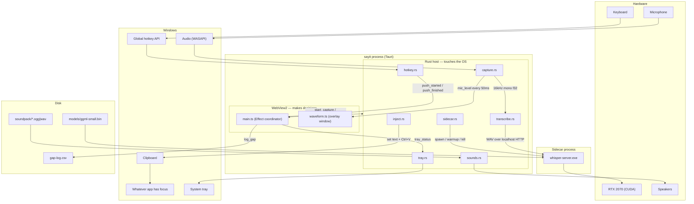

# Architecture — how sayit sits in the machine

One diagram, kept honest: if the code and this drawing disagree, one of
them is a bug. See the north star for why the shape is this way.



Three sentences that summarize the whole design:

1. **Rust touches the OS, TS makes decisions, the sidecar thinks** — every
   arrow between the webview and Rust is either an event up or a command
   down; that seam is the whole contract.
2. The four pipeline stages (hotkey → capture → transcribe → inject) never
   talk to each other — audio and text flow forward through the
   coordinator, and each stage can be replaced without the others noticing.
3. Everything stays on this machine: the model is a child process on
   localhost, the audio dies after transcription, and the only artifacts
   are the text at your cursor and a row in gap-log.csv.
```
